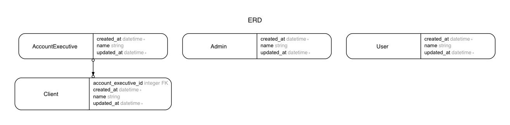

# Elastic schemasearchable demo

Ability to search through the whole application for registered models.

#### Search functionality
- Powered by [ankane/searchkick](https://github.com/ankane/searchkick)


## Get started

```
# Set up database.
bin/setup
```

```
# Seed example data to database.
rake db:seed
```

```
# Broweserify.
npm install
```

```
# Start elasticsearch server.
elasticsearch
```

```
# Reindex elasticsearch.
rake searchkick:reindex:all
```

```
# Start rails server.
rails s
```

Visit localhose:3000


## Models


